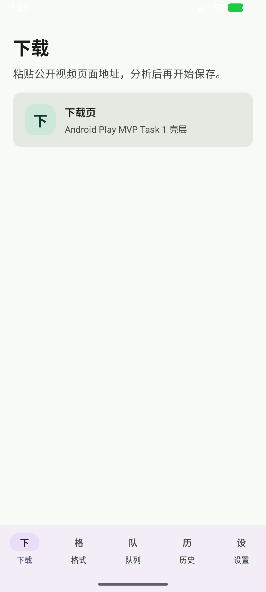

# Android Task 1 Smoke Evidence

Date: 2026-06-19

Scope: Android Play MVP Task 1 project skeleton and five-tab Compose shell.

## Verified Commands

- `powershell -ExecutionPolicy Bypass -File .\scripts\android_env.ps1`
  - Result: passed.
  - Evidence included Gradle 9.4.1, JDK 17.0.17, Android SDK `platforms;android-37.0`, and API37 AVD `ytdl_api37_play_x86_64`.

- `cd android; .\gradlew.bat :app:testDebugUnitTest`
  - Result: `BUILD SUCCESSFUL`.

- `cd android; .\gradlew.bat :app:assembleDebug`
  - Result: `BUILD SUCCESSFUL`.

- API37 emulator launch smoke:
  - AVD: `ytdl_api37_play_x86_64`.
  - APK: `android/app/build/outputs/apk/debug/app-debug.apk`.
  - `adb install -r` returned `Success`.
  - `adb shell am start -n com.garyapp.ytdl/.MainActivity` launched the app.
  - `dumpsys window` showed current focus on `com.garyapp.ytdl/com.garyapp.ytdl.MainActivity`.
  - `uiautomator dump` found labels: `下载`, `格式`, `队列`, `历史`, `设置`.

## Screenshot Evidence

## Notes

The first screenshot attempt was taken too early and captured the Android splash screen before Compose produced its first frame. A second run waited 30 seconds after launch and produced a valid UI hierarchy plus screenshot evidence. Future emulator smoke scripts should wait for both current focus and a non-splash UI hierarchy before asserting UI text.
